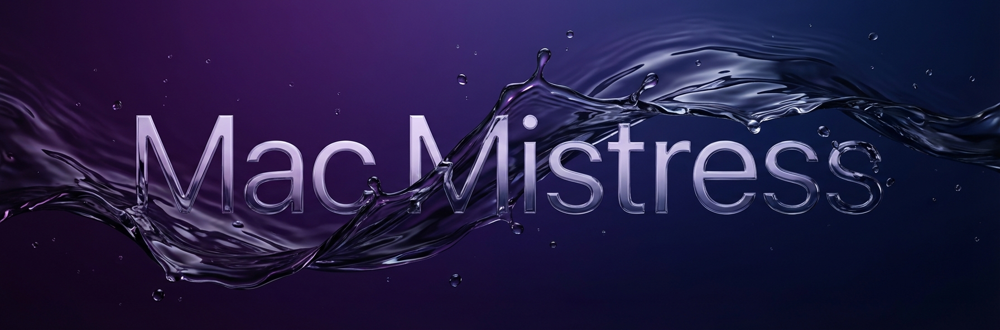

<p align="center">
  
</p>

<p align="center">
  
</p>

<h1 align="center">Mac Mistress</h1>

<p align="center">
  <em>Custom sound effects for every macOS system event.</em>
</p>

<p align="center">
  <a href="https://github.com/turingAlan/mac-mistress/releases/latest"></a>
  
  
  
</p>

---

**Mac Mistress** is a lightweight, menu-bar-only macOS app that replaces boring system sounds with custom audio for charging, battery events, screen lock/unlock, lid open, startup, shutdown, and more. Ships with curated sound presets — from anime battle cries to sensual whispers — or generate your own with ElevenLabs AI.

## Download

<p align="center">
  <a href="https://github.com/turingAlan/mac-mistress/releases/latest">
    
  </a>
</p>

> **Requires macOS 13.0 (Ventura) or later.** Universal binary — runs natively on Apple Silicon and Intel Macs.

## Features

| Feature | Description |
|---|---|
| **10 System Events** | Charging start, discharging, full charge, low battery, lid open, lock/unlock screen, startup, shutdown, restart |
| **8 Sound Presets** | System Default, Sexy, Sensual, Sensual Hindi, Shonen Anime, Kawaii Anime, Fun, AI Voice |
| **AI Voice Generation** | Generate custom sounds with your own ElevenLabs API key — type any text for each event |
| **Custom Sounds** | Use your own `.mp3`, `.aiff`, `.wav`, `.m4a`, or `.caf` files |
| **Per-Event Toggle** | Enable or disable sounds individually |
| **Global Volume** | Single slider controls all sound output |
| **Battery Threshold** | Configurable low-battery alert level (5–30%) |
| **Max Charge Alert** | Configurable max charge threshold (70–100%) — get notified before 100% to preserve battery health |
| **Launch at Login** | Optional auto-start with macOS |
| **Menu Bar App** | Lives in the menu bar — no dock icon clutter |
| **Disables macOS Chime** | Automatically silences the default charging "bong" |

## Screenshots

<!-- Add screenshots of the settings window here -->
<!-- <p align="center">
  
</p> -->

## Installation

### Download the DMG (Recommended)

1. Download the latest `.dmg` from [**Releases**](https://github.com/turingAlan/mac-mistress/releases/latest)
2. Open the DMG and drag **Mac Mistress** to Applications
3. **First launch:** If macOS says the app is "damaged" or "can't be opened", run this in Terminal:
   ```bash
   xattr -cr /Applications/Mac\ Mistress.app
   ```
   This removes the quarantine flag that macOS applies to apps downloaded from the internet.
4. Launch from Applications or Spotlight
5. Grant any requested permissions (Accessibility for system event monitoring)

### Build from Source

```bash
# Clone the repository
git clone https://github.com/turingAlan/mac-mistress.git
cd mac-mistress

# Build and run in debug mode
swift run

# Build release DMG
VERSION=1.0.0 ./scripts/build-dmg.sh
```

The DMG will be created at `build/MacMistress-1.0.0.dmg`.

> Requires Xcode 15+ and Swift 5.9+.

## Usage

1. **Launch** — Mac Mistress appears as a 💧 drop icon in the menu bar
2. **Settings** — Click the icon → **Settings…** (or press `⌘,`)
3. **Pick a preset** — Choose from built-in sound packs or set **Custom** for per-event files
4. **Fine-tune** — Enable/disable individual events, adjust volume, set battery threshold
5. **Launch at Login** — Toggle from the menu bar to auto-start

### Supported Events

| Event | Trigger |
|---|---|
| Charging Start | Charger plugged in |
| Discharging | Charger unplugged |
| Full Charge | Battery reaches 100% |
| Low Battery | Battery drops below threshold |
| Lid Open | Wake from sleep / lid opened |
| Lock Screen | Screen locked (⌃⌘Q) |
| Unlock Screen | Screen unlocked |
| Startup | App launch |
| Shutdown | System power off |
| Restart | System restart |

### Sound Presets

| Preset | Vibe |
|---|---|
| **System Default** | Classic macOS system sounds |
| **Sexy** | Sultry, flirty voice (English) |
| **Sensual** | Intimate, warm voice (English) |
| **Sensual Hindi** | Sensual voice (Hindi) |
| **Shonen Anime** | Epic battle cries (Japanese) |
| **Kawaii Anime** | Cute anime sounds (Japanese) |
| **Fun** | Quirky, goofy voice effects |
| **AI Voice** | Generate custom sounds with ElevenLabs AI |

### AI Voice Generation

The **AI Voice** preset lets you generate custom sounds using the [ElevenLabs](https://elevenlabs.io) text-to-speech API:

1. Select the **AI Voice** preset card in Settings
2. Enter your ElevenLabs API key (get one at [elevenlabs.io](https://elevenlabs.io))
3. Optionally set a custom Voice ID (defaults to "Sarah")
4. Type custom text for each sound event (e.g. *"Ooh, plugged in!"* for Charging Start)
5. Click the generate button per event, or **Generate All** to create all sounds at once
6. Generated audio is saved locally — no re-generation needed

## Generating Custom Presets

Mac Mistress includes scripts to generate sound presets:

```bash
# Using macOS text-to-speech
./generate_sounds.sh

# Using ElevenLabs API (requires API key in .env)
python3 generate_elevenlabs_sounds.py
```

Sound files go in `Sources/Resources/Presets/<PresetName>/` with naming convention:
```
charging_start.mp3
discharging.mp3
full_charge.mp3
low_battery.mp3
lid_open.mp3
lock_screen.mp3
unlock_screen.mp3
startup.mp3
shutdown.mp3
restart.mp3
```

## Project Structure

```
Sources/
├── AppDelegate.swift          # Menu bar setup & window management
├── PowerBellApp.swift         # SwiftUI app entry point
├── Audio/
│   ├── SoundManager.swift     # Audio playback engine
│   └── ElevenLabsService.swift # ElevenLabs TTS integration
├── Models/
│   ├── SoundEvent.swift       # System event definitions
│   ├── SoundPreset.swift      # Preset pack definitions & PresetManager
│   └── SoundSettings.swift    # UserDefaults-backed settings
├── Monitoring/
│   └── SystemEventMonitor.swift  # IOKit & notification observers
├── Utilities/
│   └── LaunchAtLogin.swift    # SMAppService integration
├── Views/
│   └── SettingsView.swift     # SwiftUI settings window
└── Resources/
    └── Presets/               # Bundled sound packs
scripts/
├── build-dmg.sh               # Build .app bundle & DMG installer
└── generate-dmg-assets.py     # Generate DMG background & icon
.github/
└── workflows/
    └── build.yml              # CI: build & release on tag push
```

## Privacy & Permissions

Mac Mistress:
- **Does NOT** collect any data or phone home
- **Does NOT** require internet access
- Uses IOKit to monitor power source changes (battery/charging)
- Listens to `NSWorkspace` and `DistributedNotificationCenter` notifications for system events
- Optionally registers as a login item via `SMAppService`

## Contributing

Contributions are welcome! Feel free to:

1. Fork the repository
2. Create a feature branch (`git checkout -b feature/amazing-preset`)
3. Commit your changes (`git commit -m 'Add amazing preset'`)
4. Push to the branch (`git push origin feature/amazing-preset`)
5. Open a Pull Request

### Ideas for Contributions

- New sound presets (sound packs)
- Additional system events (volume change, WiFi connect/disconnect, etc.)
- Homebrew cask formula
- Sparkle auto-update integration

## License

This project is licensed under the MIT License — see the [LICENSE](LICENSE) file for details.

---

<p align="center">
  <sub>Made with 💧 by <a href="https://github.com/turingAlan">turingAlan</a></sub>
</p>
